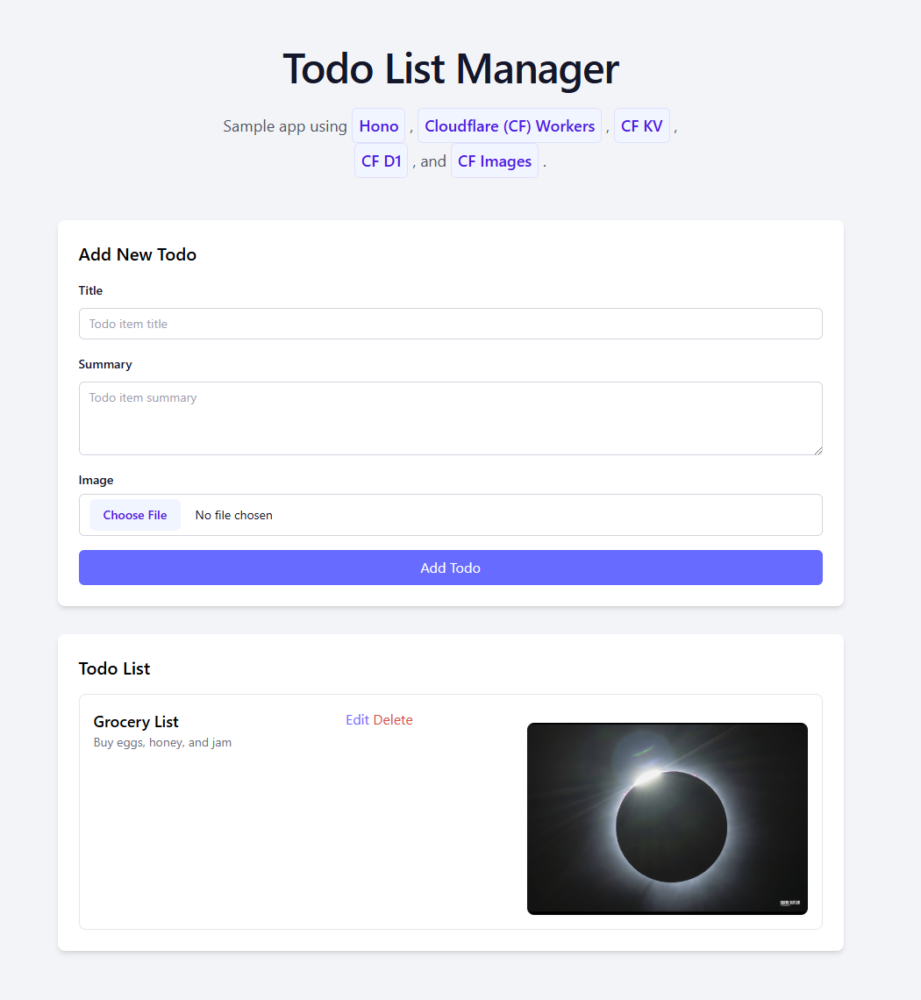

# A sample `Hono` app using Cloudflare Workers

This app showcases using `Hono` along with `Cloudflare Workers`, `Cloudflare KV`, `Cloudflare D1`, and `Cloudflare Images`.

The app was initialized using

```bash
npm create hono@latest
```

## Requirements

### Create the D1 database

1. Create a `./database/schema.sql` file (Optional)

This file already exists, but you can play around with it and modify it to match the needs of your application.

```sql
-- Drop existing table if needed
DROP TABLE IF EXISTS todos;

-- Create new table with all columns
CREATE TABLE todos (
    id INTEGER PRIMARY KEY AUTOINCREMENT,
    title TEXT NOT NULL,
    summary TEXT NOT NULL,
    imageId TEXT,
    created_at DATETIME DEFAULT CURRENT_TIMESTAMP
);
```

2. Create the database

```bash
# Create a D1 database
npx wrangler d1 create hono-app-db 
```

Capture the D1 database information returned.

3. Populate the database with schema

```bash
npx wrangler d1 execute hono-app-db --file=./database/schema.sql
```

### Create the KV cache

```bash
npx wrangler kv:namespace create "TODO_CACHE"
```

Capture the KV cache information returned.

### Configure environment variables

- Copy `.dev.vars.example` to `.dev.vars` and fill in your values

```bash
cp ./.dev.vars.example ./.dev.vars
```

The `CF_IMAGES_*` variable values are available in your Cloudflare dashboard.

- For production, set all secrets:

When ready to deploy, set the variable values in Cloudflare using `Cloudflare Secrets`.

```bash
# run each line one by one, and answer prompt
npx wrangler secret put CF_KV_NAMESPACE_ID
npx wrangler secret put CF_D1_DATABASE_ID
npx wrangler secret put CF_IMAGES_ACCOUNT_ID
npx wrangler secret put CF_IMAGES_API_TOKEN
npx wrangler secret put CF_IMAGES_ACCOUNT_HASH
```

## Getting Started

### Run the app in development

```bash
npm install
npm run dev
```

### Deploy the app to Cloudflare

Migrate the database schema remotely.

```bash
npx wrangler d1 execute hono-app-db --remote --file=./database/schema.sql
```

Deploy the app.

```bash
npm run deploy
```

## Screenshot


